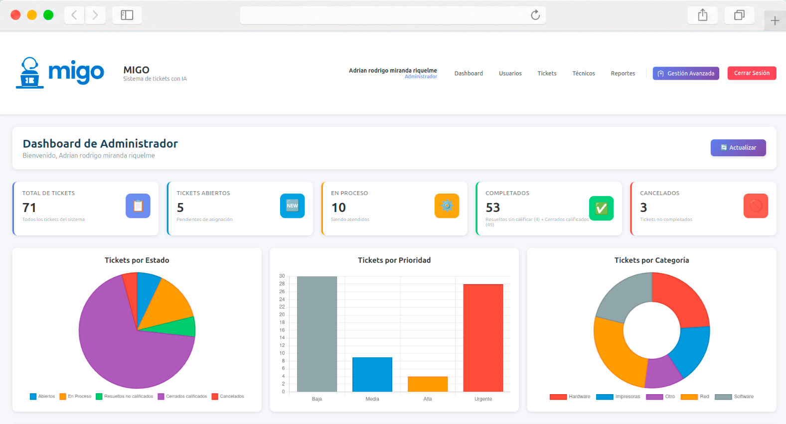

# MIGO Backend

> Backend desarrollado en Python y Django REST Framework para la plataforma SaaS MIGO, encargado de administrar la lógica de negocio, la gestión de incidencias, la autenticación, la persistencia de datos y la integración con Inteligencia Artificial mediante OpenAI.

> Plataforma SaaS para la gestión inteligente de soporte técnico, desarrollada con React, Django REST Framework e Inteligencia Artificial mediante OpenAI.

<!-- ===================================================== -->
<!-- HERO                                                   -->
<!-- Título: Vista General de MIGO                          -->
<!-- Imagen: images/test.png                -->
<!-- Imagen principal del proyecto (Dashboard Administrador)-->
<!-- ===================================================== -->
<h2 align="center">Index</h2>

  

---

## Descripción

MIGO centraliza la gestión de incidencias de soporte técnico dentro de una organización, permitiendo a usuarios, técnicos y administradores trabajar sobre una misma plataforma.

Además de administrar el ciclo completo de los tickets, incorpora Inteligencia Artificial para asistir en la resolución de incidencias, generar métricas de desempeño y apoyar la toma de decisiones mediante análisis operacionales.

---

## Características Principales

- Gestión completa de tickets.
- Priorización automática de incidencias.
- Panel independiente para Usuarios, Técnicos y Administradores.
- Dashboards con indicadores operacionales.
- Asistente técnico basado en OpenAI.
- Historial completo de tickets.
- Evaluación del servicio mediante calificaciones y reclamos.
- Reportes y métricas de desempeño.
- Arquitectura desacoplada Frontend / Backend.

---

## Arquitectura

Frontend

- React
- JavaScript
- Axios
- React Router DOM

Backend

- Python
- Django
- Django REST Framework

Base de Datos

- MySQL

Servicios

- OpenAI API

---

## Capturas

### Dashboard Administrador

<!-- ===================================================== -->
<!-- Título: Dashboard Administrador                        -->
<!-- Imagen: images/dashboard-admin.png                     -->
<!-- Vista general de la operación del sistema              -->
<!-- ===================================================== -->
<h2 align="center">Dashboard Administrador</h2>

  

 
<h2 align="center">Collage Dashboard Admin</h2>

  

---

### Dashboard Técnico

<!-- ===================================================== -->
<!-- Título: Dashboard Técnico                              -->
<!-- Imagen: images/dashboard-tecnico.png                   -->
<!-- Gestión de tickets asignados                           -->
<!-- ===================================================== -->
<h2 align="center">Dashboard Técnico</h2>

  

 
<h2 align="center">Collage Dashboard Técnico</h2>

  

---

### Dashboard Usuario

<!-- ===================================================== -->
<!-- Título: Dashboard Usuario                              -->
<!-- Imagen: images/dashboard-usuario.png                   -->
<!-- Portal de creación y seguimiento de tickets            -->
<!-- ===================================================== -->
<h2 align="center">Dashboard Usuario</h2>

  

 
<h2 align="center">Collage Dashboard Usuario</h2>

  

---

### Gestión de Tickets + Inteligencia Artificial

<!-- ===================================================== -->
<!-- Título: Ticket con Asistente IA                        -->
<!-- Imagen: images/ticket-ia.png                           -->
<!-- Pantalla del ticket mostrando la ayuda de OpenAI       -->
<!-- ===================================================== -->
<h2 align="center">Gestión de ticket</h2>

  

---

### Analítica e Inteligencia Artificial Admin

<!-- ===================================================== -->
<!-- Título: Dashboard Analítico                            -->
<!-- Imagen: images/dashboard-analitica.png                 -->
<!-- Métricas, gráficos y recomendaciones IA                -->
<!-- ===================================================== -->

<h2 align="center">Analítica e Inteligencia Artificial</h2>

  

  

---

<!-- ### Responsive Design --> 

<!-- ===================================================== -->
<!-- Título: Responsive Design                              -->
<!-- Imagen: images/responsive.png                          -->
<!-- Desktop + Tablet + Mobile                              -->
<!-- ===================================================== -->

---

## Documentación

La documentación técnica completa se encuentra en:

📄 [Case Study de MIGO](docs/case-study.md)

Incluye:

- Arquitectura
- Modelo de datos
- Inteligencia Artificial
- Seguridad
- Stack tecnológico
- Roadmap
- Resultados
- Conclusiones

---

## Estado del Proyecto

Proyecto funcional desarrollado como plataforma SaaS para soporte técnico empresarial.

Actualmente contempla futuras mejoras relacionadas con RAG, clasificación automática de tickets, asignación inteligente de técnicos y análisis predictivo.

---

## Autor

**Adrián Miranda**

Ingeniería de Software | Desarrollo Full Stack | Inteligencia Artificial

LinkedIn: *(agregaremos el enlace al finalizar la optimización del perfil)*

Portafolio: *(agregaremos adrianmiranda.cl cuando esté terminado)*
